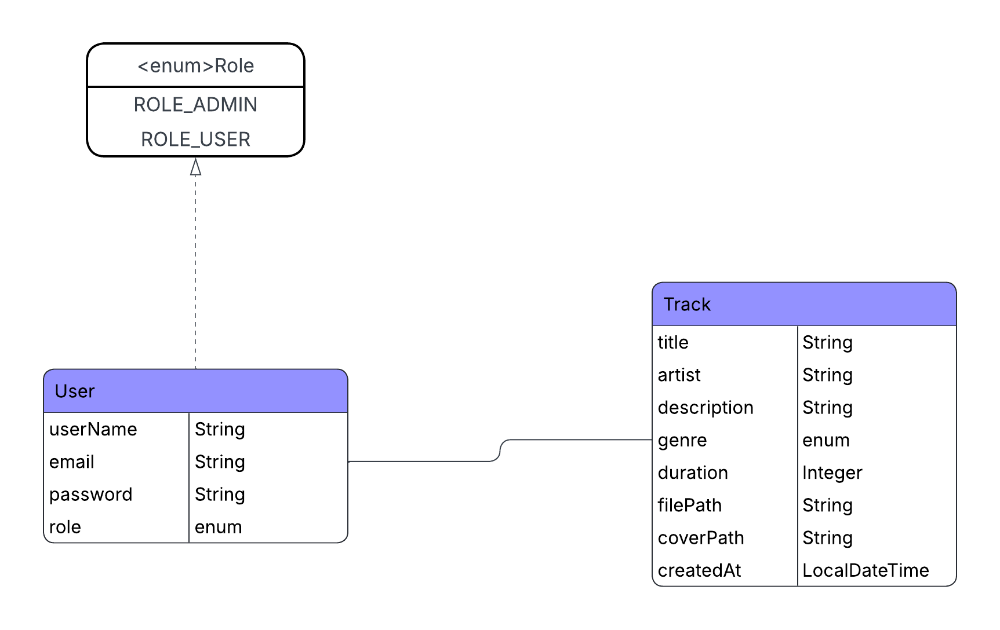

# 🎵 Havana Music Streaming Platform

A modern, full-stack music streaming application built with **Angular (Frontend)** and **Spring Boot (Backend)**, designed to provide a seamless listening experience.



## 🚀 Overview

Havana (MusicStream) is a Spotify-inspired web application that allows users to discover, upload, and listen to music. It features a robust authentication system, a dynamic player with playlist support, and an admin interface for managing tracks.

## 🛠️ Tech Stack

### Frontend
- **Framework**: Angular 17+ (Standalone Components, Signals)
- **State Management**: NgRx (Store, Effects)
- **Styling**: TailwindCSS
- **Design System**: Glassmorphism & Dark Mode aesthetic

### Backend
- **Framework**: Spring Boot 3
- **Language**: Java 17
- **Database**: MySQL
- **Security**: Spring Security + JWT
- **Build Tool**: Maven

### Infrastructure
- **Containerization**: Docker & Docker Compose

## ✨ Key Features

- **🔐 Authentication**: Secure Login & Registration system with JWT support.
- **🎧 Music Player**: Persistent global player with Play/Pause, Next/Previous, and Progress control.
- **📂 Track Management**:
  - **Upload**: Support for Audio files (MP3, WAV, OGG) and Cover Images.
  - **Update**: Edit metadata and replace cover images.
  - **Delete**: Admin capability to remove tracks.
- **📜 Playlist Management**: Context-aware queue that remembers the list of tracks being played.
- **🔍 Search**: Real-time filtering and pagination of tracks.

## 🐳 Getting Started (Docker)

The easiest way to run the project is using Docker Compose.

1. **Clone the repository**
   ```bash
   git clone https://github.com/your-repo/havana-project.git
   cd havana-project
   ```

2. **Run with Docker Compose**
   ```bash
   docker-compose up --build
   ```
   This will start:
   - **Frontend**: http://localhost:4200
   - **Backend**: http://localhost:8080
   - **Database**: MySQL on port 3306

## 📦 Manual Setup

### Backend (Spring Boot)
1. Navigate to `havana-backend`.
2. Configure `application.properties` with your MySQL credentials.
3. Run the application:
   ```bash
   mvn spring-boot:run
   ```

### Frontend (Angular)
1. Navigate to `havana`.
2. Install dependencies:
   ```bash
   npm install
   ```
3. Start the development server:
   ```bash
   npm start
   ```

## 📐 Architecture
The project follows a clean layered architecture:
- **Frontend**: Feature-based directory structure (`features/`, `core/`, `shared/`) using the Facade pattern via NgRx.
- **Backend**: Standard Controller-Service-Repository pattern with DTOs for data transfer.
